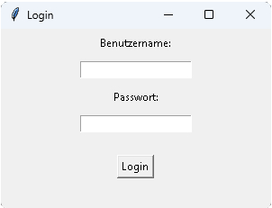
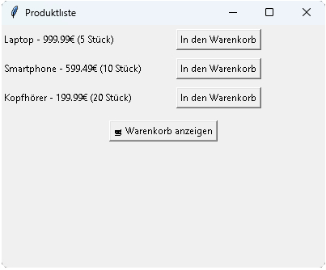
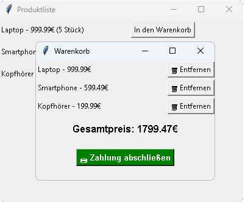
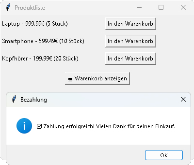

# 🛍 Python E-Commerce GUI App (mit Login & Warenkorb)

Ein voll funktionsfähiger Mini-Shop mit Benutzer-Login, Warenkorb, Produktverwaltung und Bezahl-Simulation – entwickelt mit Python, Tkinter und SQLite.

---

## 🚀 Features

- 🔐 **Benutzer-Login mit Passwort-Hashing (SHA-256)**
- 🛒 **Produkte aus SQLite-Datenbank anzeigen**
- ➕ **Produkte in den Warenkorb legen**
- 🗑 **Produkte aus dem Warenkorb entfernen**
- 💳 **Zahlung abschließen (Simulation mit Erfolgsmeldung)**
- ✅ **GUI mit dynamischen Fenstern (Tkinter)**
- 💾 **Datenbank dauerhaft mit Benutzer- & Produktdaten**

---

## 📸 Screenshots

|           Login            |           Shop            |           Warenkorb            |           Zahlung            |
| :------------------------: | :-----------------------: | :----------------------------: | :--------------------------: |
|  |  |  |  |

---

## 🛠 Installation

### 1. Repository klonen

```bash
git clone https://github.com/JohannHelbert/python-gui-ecommerce.git
cd python-gui-ecommerce
```
